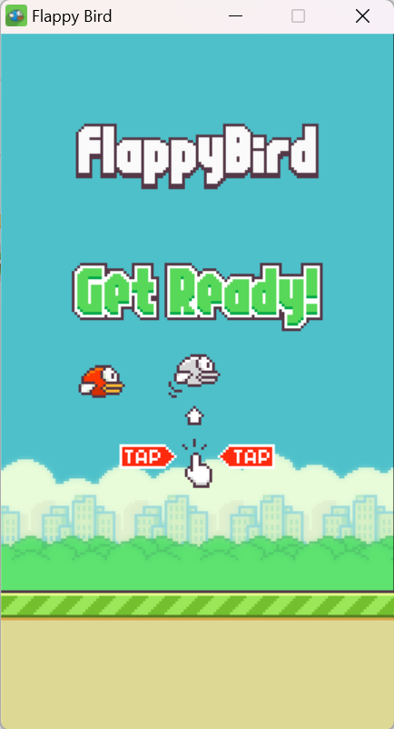

<div align="center">
<h2 align="center">Flappy Bird</h2>

<h4 align="A simple Flappy Bird game that is made in Python/PyGame.</h4>

<h5>Github Deploy</h5>
<a href="https://itzkashiii.github.io/KPOP-Music-Player/"><strong>🡆 Live Website</strong></a>
</div>

<div>
<h6>Output</h6>

</div>

### Clone and Run
To run this __**Flappy Bird Game**__, type and this command in Windows Powershell or other Terminal:
(Clone)
```bash
git clone https://github.com/ItzKashiii/Flappy-Bird.git
```
After cloning this you should install the most important module of all to run the game. :
(Installing Modules)
```bash
py -m pip install pygame
```
or
```bash
pip install pygame
```
(Run)
If you're using `Visual Studio Code` open the terminal ```ctrl + shift + ~``` and type ```py main.py```

### Star
Star this repo if you like this repo, Thank you!
